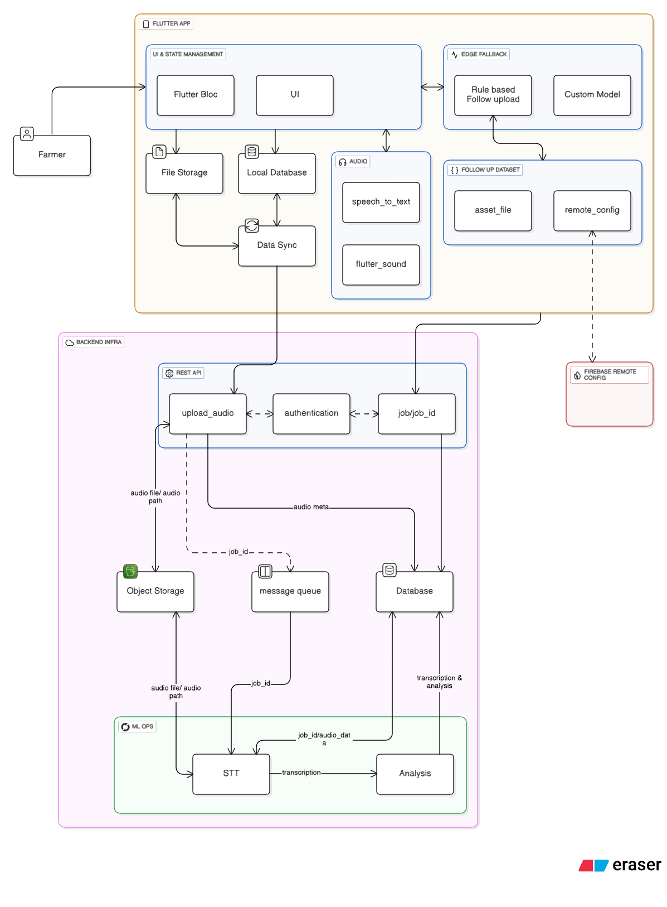

# Architecture

## Diagram

## Mobile App Architecture

The Mobile app will be build using `flutter_bloc` with clean and offline first architecture to support poor connectivity.

The audio will be recorded using `flutter_sound` package since it support audio recording and playback. The audio will be recorded in `.wav` formant for processing for ML.

Audio Files are stored in File Storage and file path and meta data are stored in Local Database (Isar)

Once the audio is saved in storage and database, and try instant upload if connectivity is there , else mark the status as pending

#### Local Database Scheme

id , file_path, farmer_id ,created_at, sync_status

#### Data Syncing

The `workermanager` will be utilized to upload the files to backend and update the sync status periodically. The connectivity will be checked using `connectivity_plus`

#### Offline Support

In offline cases, after recording the audio, the app prompts the farmer to select the most appropriate issue category from a predefined dataset. Each options maps to a set of keywords and followup questions. 

The default set of data mappings are stored in app to support offline availability. When connectivity is established, these rules dataset is updated via Remote Config, allowing improved dataset to be rolled out without requiring an app update.

##### Enhancement

As research imporoves,a light weight on device model can be trained and embeded in app using tensorflow lite to classify the common issues. This improves automation but comes with tradeoff such as increased app size, device cpu usage and model maintenance overhead

In addition , we can use flutter speech_to_text to utilize the speech recognition capability to capture the keywords and trigger the edge cases in case of poor connectivity

## Backend Architecture

Microservice based architecture using Fast API will be used to create the API. If in future , Admin panel and more features are required, those can be build using Django.

The uploaded audio is stored in storage bucket. The url, metadata and the job id is stored to the database and add the ML Job is added to the job queue and the result is returned to the app.

The Job status can be checked using the job api by periodically checking the pending job status. FCM notification to the device can also be added as enhancement.

## Tech Stack

| Layer      | Technology             | Reason                        |
| ---------- | ---------------------- | ----------------------------- |
| Mobile App     | Flutter                |cross-platform, can integrate native code if needed |
| State Management      | flutter_bloc | Scalable , Predictive State Management |
| Route Management      | go_router | Scalable , Backed by Flutter Team,  |
| Audio      | flutter_sound | Stable, widely used, Record and Playback           |
| Local DB   | Isar       | Fast, offline-friendly         |
| Backend    | FastAPI (Micro service)| Clean, async Support|
| Storage    | AWS S3             | Scalable                      |
| Backend Database      | Postgresql (AWS RDS)       | scalable, open source|
